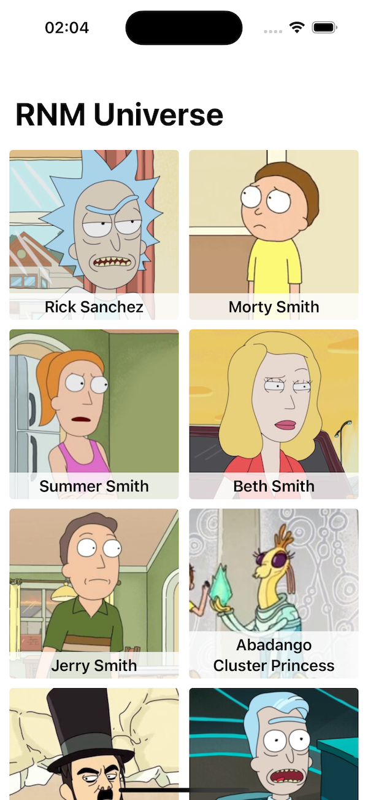
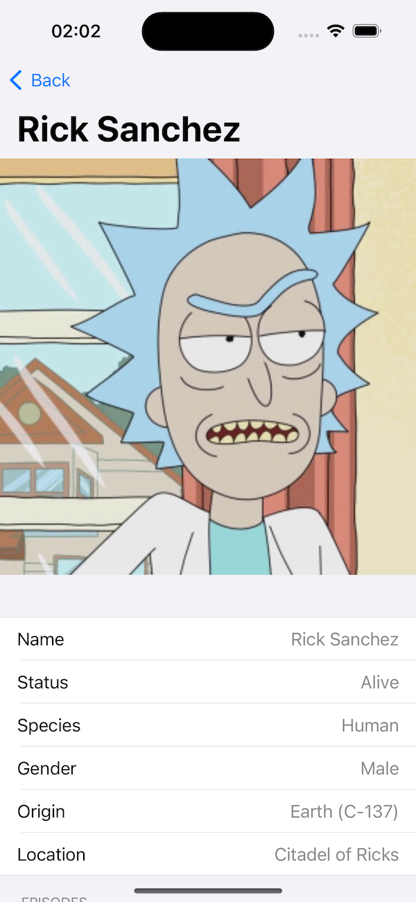
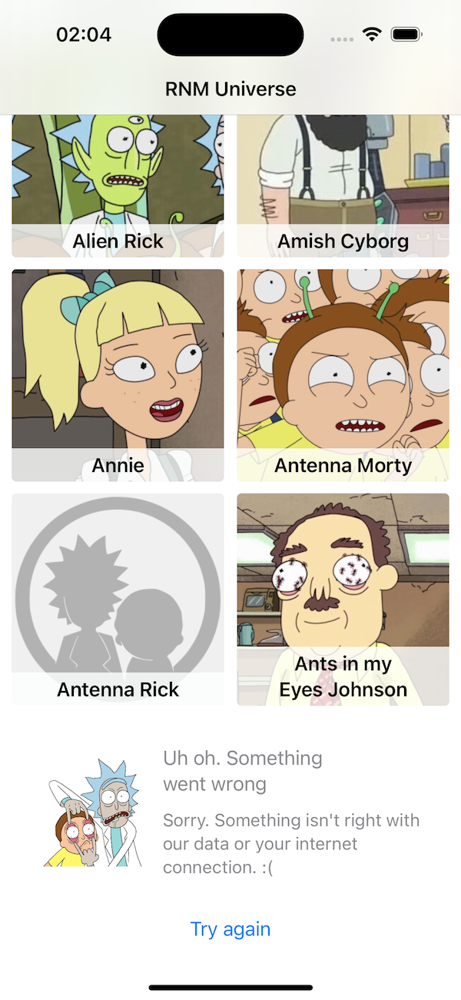
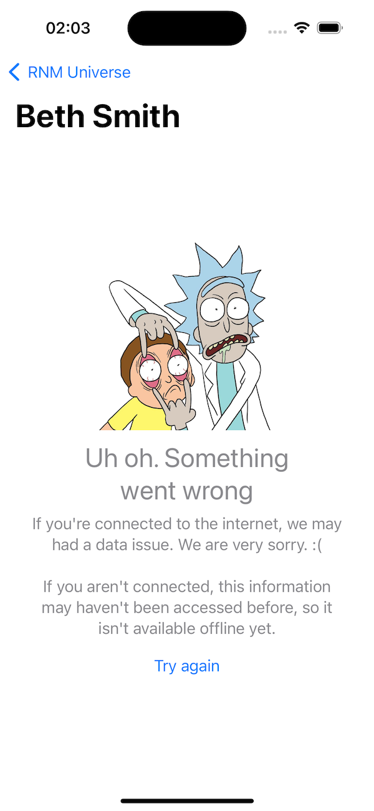
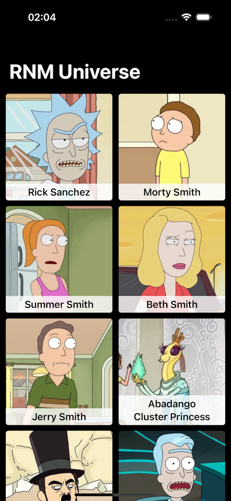
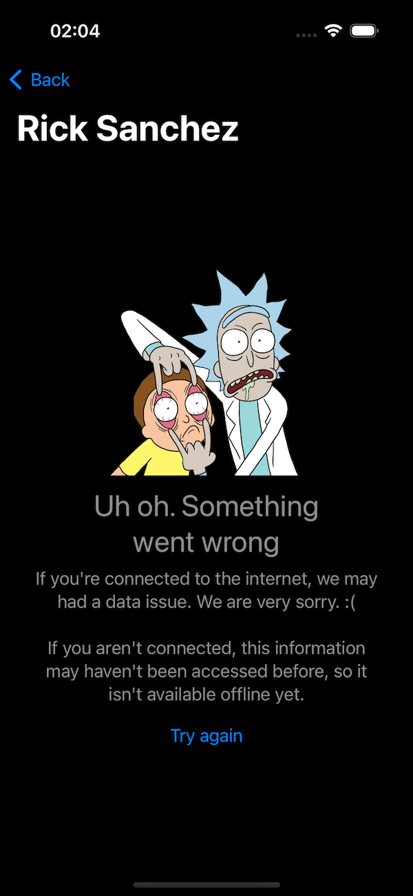

# RNM UNIVERSE PROJECT #

### Kinzoo iOS Challenge ###

An iOS app with a list and details of characters.

### Nice to know ###

* I believe that I've built this project following all the requested requirements, except for the "Universal link support".
* I've used some third-party libraries and I've developed other points manually, such as the network layer, for example.
* I took advantage of this opportunity to extract a local target from one of my projects for a Pod. A library that I developed a few years ago with the desire to make UICollectionView and UITableView easier to use.
* I tried to address some points that were not directly requested, but that I understand are fundamental for a good app, such as icons, fonts, responsiveness, dark mode, location, loader and error handling, for example.
* I chose to use CocoaPods for all libs and not mix in with SPM.
* I've already used Rswift and SwiftGen to generate typed resources, however, I had difficulties configuring both in Xcode 15 with the new String Catalog (I got SwiftGen for the other resources, but not for strings). As I wouldn't use it for the others, since Xcode is creating some now, I preferred not to use it.
* I preferred to use Promise instead of async/await, as I see a more pleasant syntax and I'm more used to it at the moment.

### Some Prints ###

